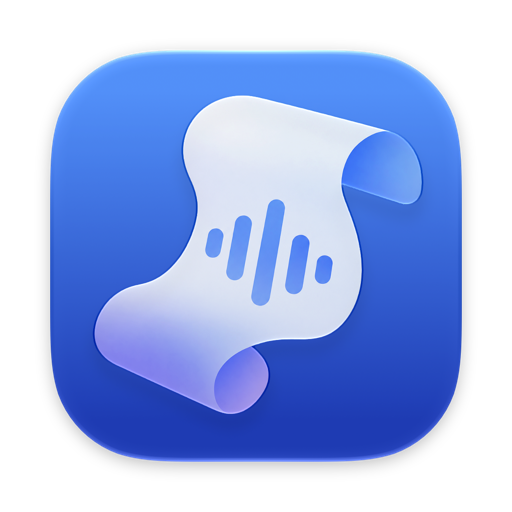

# 記す

**Say it, and it's written. Write it, and it's said.**

A Mac app that turns speech into text and text into speech —
without sending a word of it anywhere.

*記す — to write it down.*

---

## What you can do with it

### 📄 Turn a recording into text

Drop in a voice message, an interview, a lecture, a meeting you recorded. Read
it back as text you can copy. It keeps the punctuation and the capital letters,
so you get something that reads like writing rather than a wall of words.

### 💬 Put captions on anything

Hold the Globe key (🌐) and a caption bar follows what is being said — the
person in front of you, or whatever your Mac is playing. A video with no
subtitles, a call, a voice note from a friend who talks fast.

### 🎙 Dictate into any app

Hold 🌐, say what you mean, let go. The words appear where your cursor already
was — your email, your chat, your notes, anywhere you were already typing. No
window to switch to, nothing to copy across.

### 🔊 Hear it read out loud

Type something and listen to it. Pick one of ten ready voices, copy a voice from
a recording, or just describe the voice you want — "an older man, hoarse,
speaking slowly" — and hear it invented.

---

## It cleans up how people actually talk

Nobody speaks in finished sentences. You start again, you say "um", you change
your mind halfway: *"send it to Pedro — no, to João."*

記す can tidy that before the words land. One recipient, no "um", the sentence
you meant. There are seven ways to be tidied, from **Faithful** (fix the
stumbles, touch nothing else) through **Casual** and **Formal** to **Shorter**,
and you can write your own.

It is careful on purpose. Anything it comes up with is checked against what you
actually said — same language, same numbers, recognisably the same sentence —
and thrown away if it drifted. A tidy-up that quietly says something *slightly*
different is worse than leaving the "um" in.

---

## Nothing leaves your Mac

This is the part worth saying plainly: your voice, your recordings and your
dictation stay on the machine. The listening, the tidying and the speaking all
happen locally. There is no account, no upload, no server.

The one exception is something you have to switch on yourself: if you want
Google's Gemini to do the tidying instead of Apple's on-device model — useful
when you want a spoken sentence expanded into a whole document — you can. It is
off by default, and your API key is kept in the Keychain.

---

## Getting started

**You'll need** a Mac with Apple Silicon running macOS 27 or later.

**First launch** downloads the model that does the listening. The window opens
straight away and you can start using Text to Speech while it comes down.
Voice-copying models are only fetched if and when you ask for one.

**To use the Globe key**, two things need setting up once:

1. Open **System Settings → Keyboard → "Press 🌐 to"** and choose **Do Nothing**.
   Otherwise the key still belongs to the emoji picker.
2. Give 記す **Accessibility** permission when it asks. That is what lets it
   notice the key while you are in another app, and type the words where your
   cursor is. It only watches the key — pressing it still does everything else
   it normally would.

It will also ask for the microphone, and for permission to hear your Mac's own
audio if you want captions on what is playing. Each one is asked for when you
first use the feature that needs it, never up front.

---

## Languages

It understands **25 languages** and handles the mixed sentences people really
write — an English word dropped into a Portuguese one comes back spelled right.
It speaks **8**: Portuguese, English, Spanish, French, German, Italian, Japanese
and Korean.

The app itself is in English and Brazilian Portuguese.

---

## Building it yourself

Open `Shirusu.xcodeproj` in Xcode 27 and run. Swift Package Manager fetches the
dependencies on first open; nothing else to set up.

Under the hood: SwiftUI and Swift 6, Parakeet TDT v3 through
[FluidAudio](https://github.com/FluidInference/FluidAudio) for listening,
Apple's Foundation Models for the tidying, and Supertonic, Chatterbox and
VoxCPM2 for the voices.
